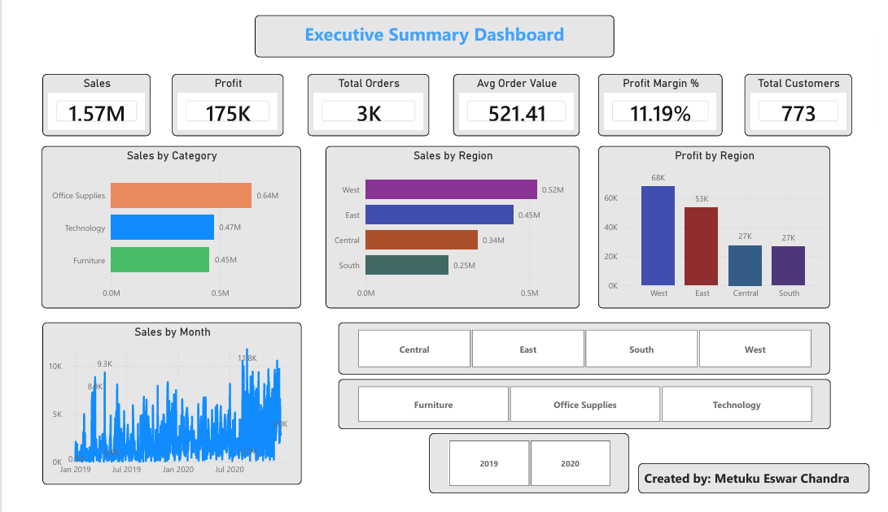
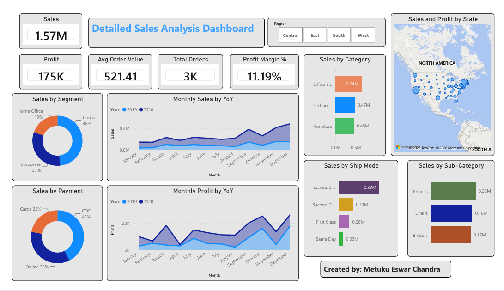
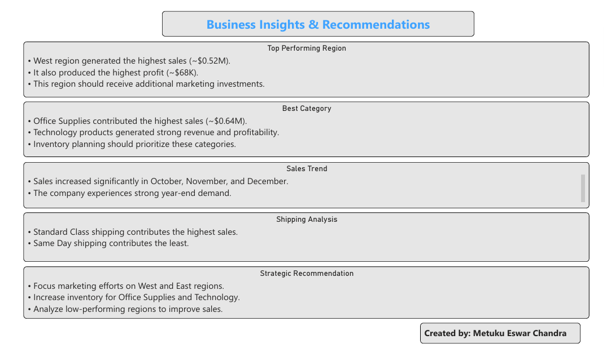
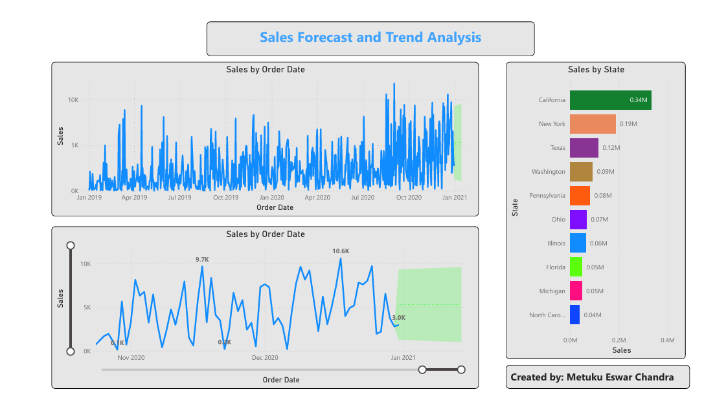
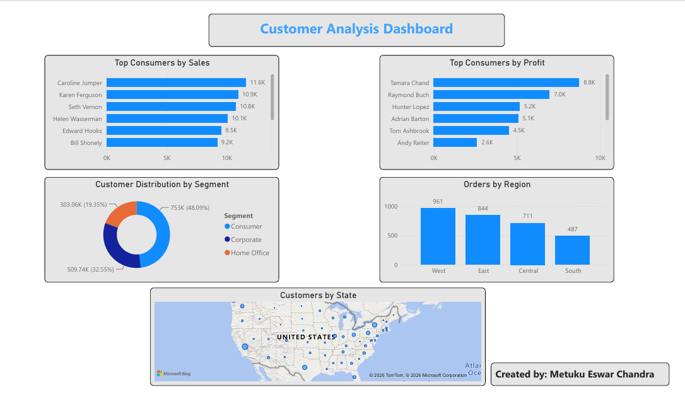

# Retail Sales Analytics Dashboard

Interactive Retail Sales Analytics Dashboard built using Power BI to analyze sales performance, customer behavior, profitability, and forecast future sales trends.

**Author:** Metuku Eswar Chandra  
**Institute:** National Institute of Technology Raipur  
**Branch:** Electronics and Communication Engineering

## Project Overview
This project analyzes retail sales data using Power BI and provides insights into:

- Sales performance
- Profit analysis
- Customer analysis
- Sales forecasting
- Business recommendations

## Tools Used
- Power BI
- Microsoft Excel
- DAX
- Power Query

## Key Metrics
- Total Sales: 1.57M
- Total Profit: 175K
- Total Orders: 3K
- Total Customers: 773
- Average Order Value: 521.41

## Dashboard Pages
1. Executive Summary Dashboard
2. Detailed Sales Analysis Dashboard
3. Business Insights & Recommendations
4. Sales Forecast and Trend Analysis
5. Customer Analysis Dashboard

## Project Files
- Retail_Sales_Analytics_Dashboard.pbix
- Dashboard_Report.pdf
- Dataset
- Screenshots

## Key Insights
- West region generated the highest sales and profit.
- Office Supplies contributed the highest sales.
- Sales increased significantly during October, November, and December.
- Standard Class shipping contributed the highest sales.

## Dashboard Preview

### Executive Summary

### Detailed Analysis

### Business Insights

### Sales Forecast

### Customer Analysis

